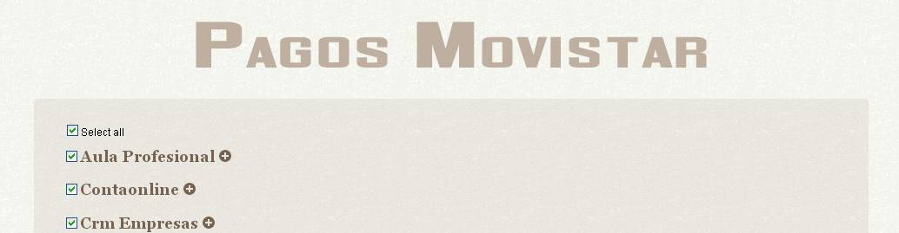
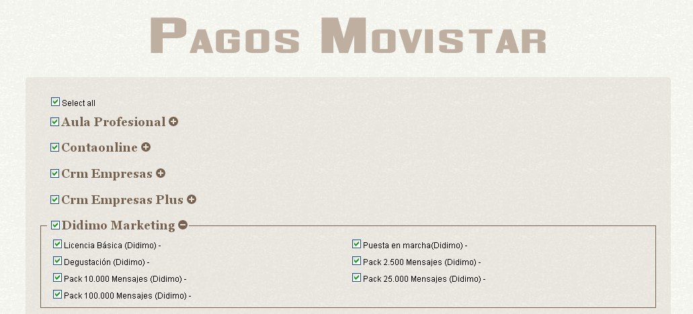
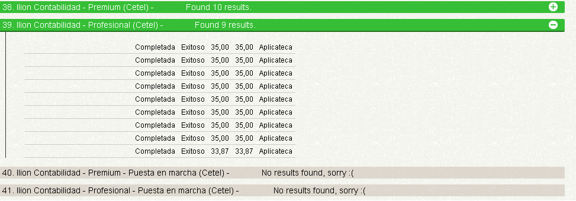

Pagos Movistar
==============

Testers had a hard time checking purchase test results on external systems, so I created this little rails
application that lets them select what products they want to check, and automatically requests them
and shows in the same page, without reloading.

Checking these results manually was painfully slow, as there are many steps involved into it. This
application removes that pain by allowing them to stay on the same page checking other results or
even doing whatever they want to do while the system is busy requesting other results.

_Note:_ This repo is only intented for portfolio purposes. Code won't even compile, as I have
removed all the sensible parts

Screenshots
===========

